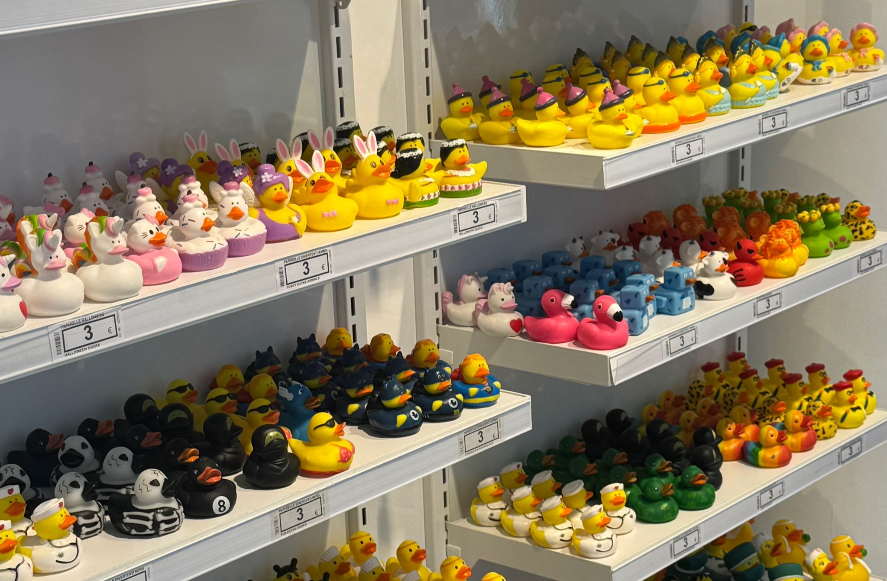

<!-- Banner aestethic dark -->

  

<h1 align="center">🌙✨ Ciao, sono <strong>Alaa</strong> ✨🌙</h1>

  👩‍💻 Studentessa di Informatica • 🗂️ Segretaria 
  🌌 Amante della tecnologia, dell’estetica e della crescita personale

---

## 🖤 Chi sono
Ciao! Sono **Alaa**, studio **informatica** e lavoro come **segretaria** in un’azienda.  
Adoro imparare cose nuove, migliorarmi e creare piccoli progetti.
---

## 🌸 Cosa sto imparando
- 💡 Fondamenti di programmazione  
- 🌐 programmazione ad oggetti   
- 📁 puntatori  
- 🧠 class vector  

---

## 🛠️ Tech & Tools

  

---

## 🌙 Obiettivi 2025
- 🚀 Migliorare le mie capacità di programmazione  
- 🌱 Crescere professionalmente  
- 🖥️ Creare progetti personali  
- ⭐ Diventare più sicura nelle mie competenze

---

## 💌 Contatti
Se vuoi connetterti con me:

- 📧 Email: stu-aboibrahimalaa@itis-molinari.eu

---

  

🌑 Grazie per aver visitato il mio profilo GitHub! ✨

